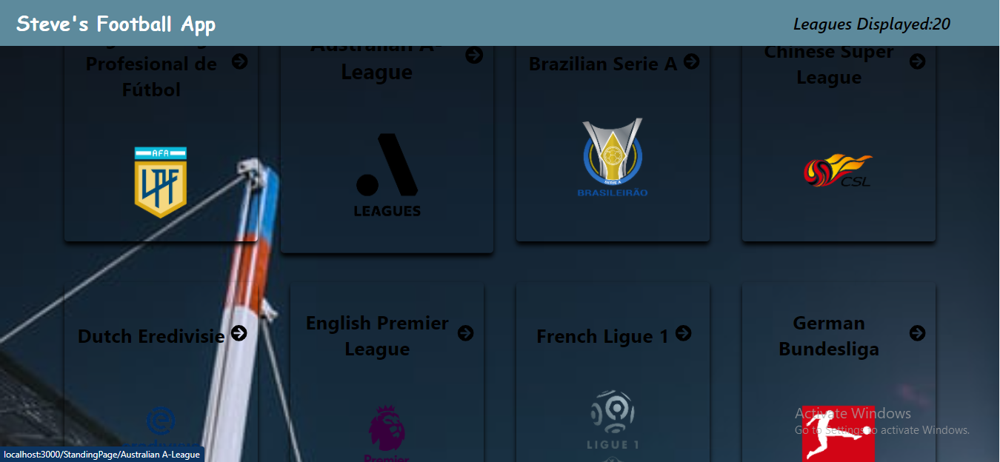
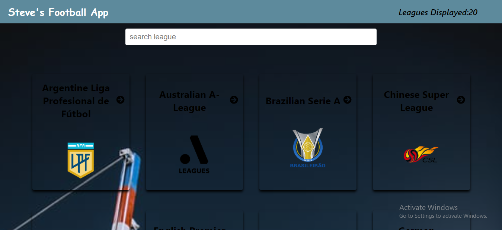
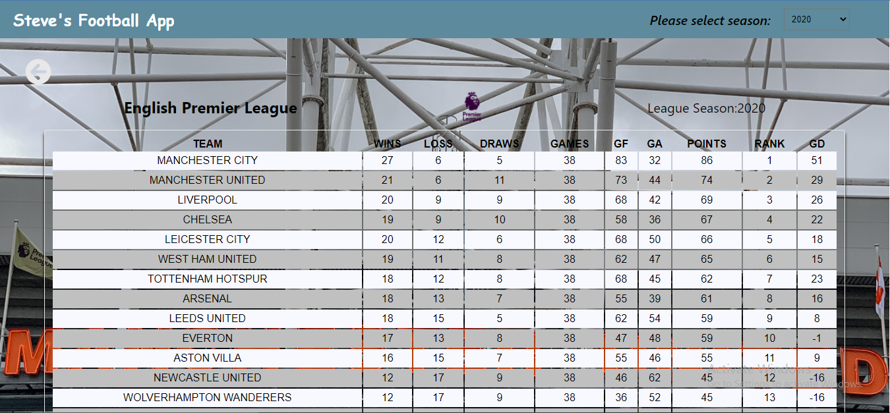
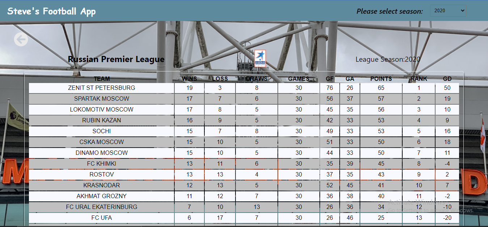

# Steven's Football App
- In this task, i worked with real live data gotten from football-standing-api ```https://github.com/azharimm/football-standings-api```. I was tasked with fetching an array of leagues from the api and displaying each league on the homepage. Also, when the user clicks on a particular league, the league table/standing table forthat league displays in the standing page.

## Project Preview

Home page                             |  Home page
:---------------------------------------:|:---------------------------------------:
       |   

Standing page view                       |  Standing Page View
:---------------------------------------:|:---------------------------------------:
      |   

## Live Demo
> Click [here](http://steven-football-app.herokuapp.com/) to see the live preview of the project.

## Watch Live Presentation
> Click [here]('') to see a live presentation of the project.

### Built With

- [React](https://es.reactjs.org/)
- [HTML](https://www.w3schools.com/html/)
- [CSS](https://www.w3schools.com/css/)
- [JS](https://www.javascript.com/)

# Getting Started with Create React App

This project was bootstrapped with [Create React App](https://github.com/facebook/create-react-app).

### Installation

1. Clone the repository
   ```
   git clone https://github.com/mckent05/my-football-app.git
   ```
2. Install NPM packages
   ```
   npm install
   ```
3. Run server
   ```
   npm start
   ```
## Testing

1. Run 
  `npm test`
## Authors

👤 **Akinlade Temitope**

- GitHub: [@mckent05](https://github.com/mckent05)
- Twitter:[@mckent05](https://twitter.com/mckent05)
- Linkedin: [AkinladeTope](https://www.linkedin.com/in/akinladetemitope/)

## 🤝 Contributing

Contributions, issues, and feature requests are welcome!

Feel free to check the [issues page](../../issues/).

## Show your support

Give a ⭐️ if you like this project!
